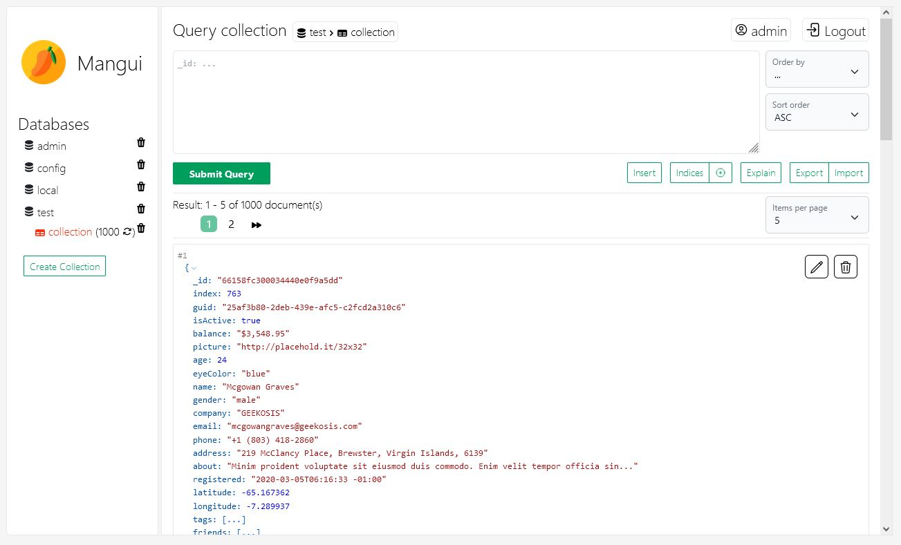

  

# Mangui - MongoDB Management Tool

Mangui is a powerful multi-user MongoDB Management Tool designed as a React Web App with a Spring Boot Backend. It
simplifies the process of managing MongoDB databases by offering a wide range of features and functionalities, including
Docker support for easy deployment.

## Features

- **Document Management**:  Perform CRUD operations including read, update, and delete documents. Create new collections
  effortlessly through intuitive modals.
- **Sorting and Pagination**: Easily sort and paginate through large datasets, with customizable items per page.
- **Index Management**: Manage database indexes efficiently through intuitive modals.
- **Import and Export**: Import data with customizable file sizes and export data effortlessly.
- **Query Support**: Utilize autocomplete for MongoDB keywords such as $in, $exists, $not, and more. Enjoy automatic
  bracket completion for queries.
- **User Security**: Ensure per-user data security with access and refresh tokens. Manage users and their permissions
  through user management modals.
- **Toast Notifications**: Receive toast notifications for important events and actions, enhancing user experience and
  providing real-time feedback.
- **Customizable Data Views**: Enjoy customizable data views with themes, display options for JSON data (nesting,
  collapsing, etc.), and perform actions like "copy to clipboard" and more.
- **Responsive UI**: Enjoy a responsive and intuitive user interface.
- **Fast Performance**: Experience fast performance for seamless database management.

## Installation and Deployment

- **Local Setup**: Run Mangui locally as two separate apps.
- **Docker Deployment**: Deploy Mangui in a Docker container for easy deployment and scaling.
- **Customizable Environment**: Customize properties like available MongoDB hosts, virtual hosts for Nginx, upload file
  size, and more using Docker container environment variables.
- **Deployment Templates**: Use provided templates for localhost and server deployment, with images for automatic Let's
  Encrypt certificates and reverse proxy for routing traffic.
- **Bash Scripts**: Utilize Bash scripts for creating frontend and backend artifacts and serving them in Docker
  containers.

## Screenshots

### Find more screenshots over [here](screenshots/README.md)

## Getting Started

To get started with Mangui, follow the installation and deployment instructions in
the [documentation](documentation/README.md).

## Contribution

Contributions are welcome! Feel free to submit bug reports, feature requests, or pull requests.

## License

This project is licensed under the [MIT License](LICENSE).

## Dependencies / Credits

- **react18-json-view**: [GitHub Repository](https://github.com/YYsuni/react18-json-view/)
- **react-toastify**: [GitHub Repository](https://github.com/fkhadra/react-toastify)
- **react-router**: [GitHub Repository](https://github.com/remix-run/react-router)
- **tailwindcss**: [GitHub Repository](https://github.com/tailwindlabs/tailwindcss)
- **heroicons**: [GitHub Repository](https://github.com/tailwindlabs/heroicons)
- **eslint**: [GitHub Repository](https://github.com/eslint/eslint)

---

For more information, visit our [website](https://github.com/Prime1Code/mangui) or check out
our [GitHub repository](https://github.com/Prime1Code/mangui).
