### [back](../README.md)

# Mangui Screenshots

## Overview

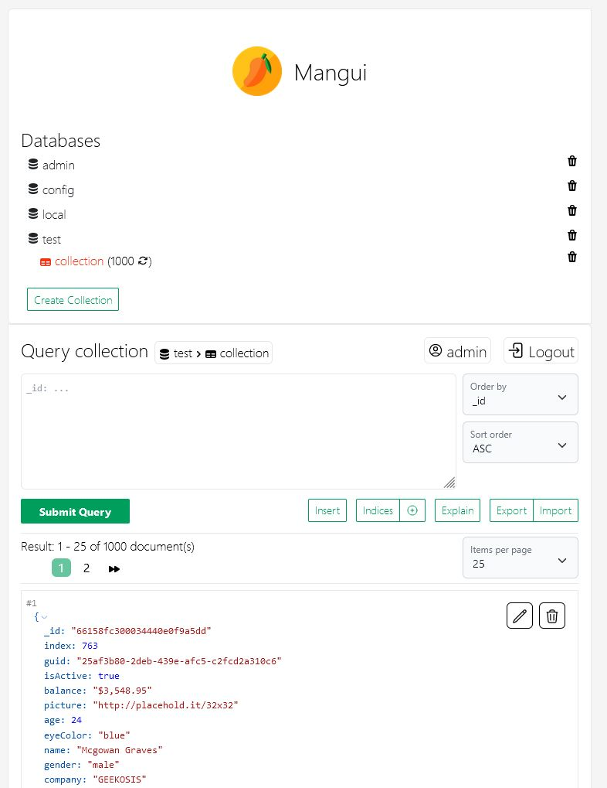

## Login

## Collections

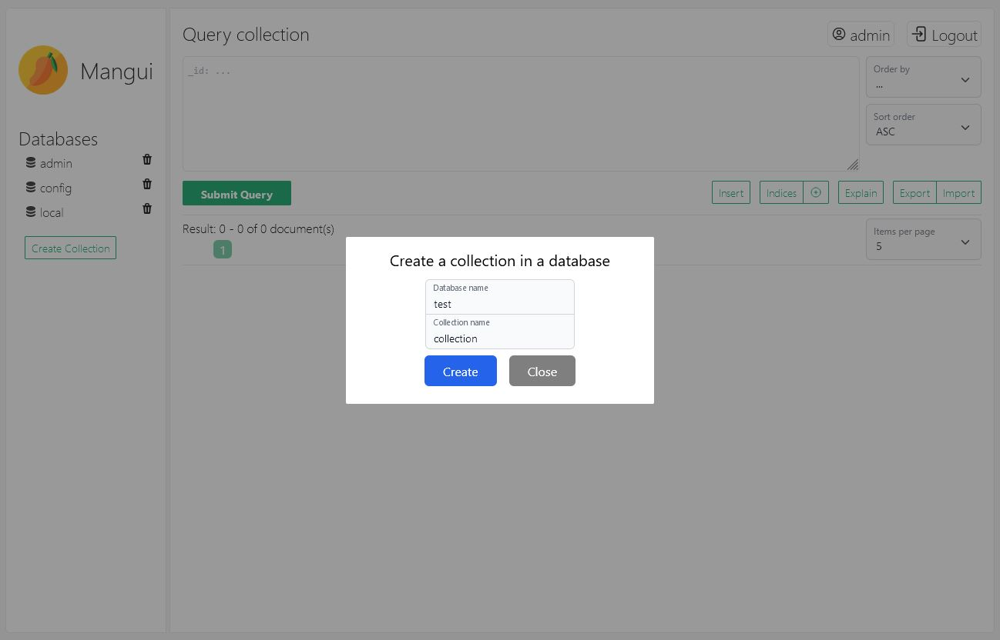

## Queries

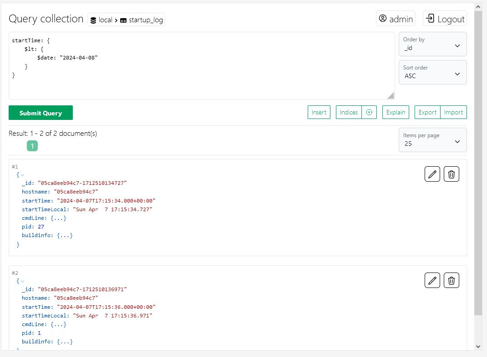
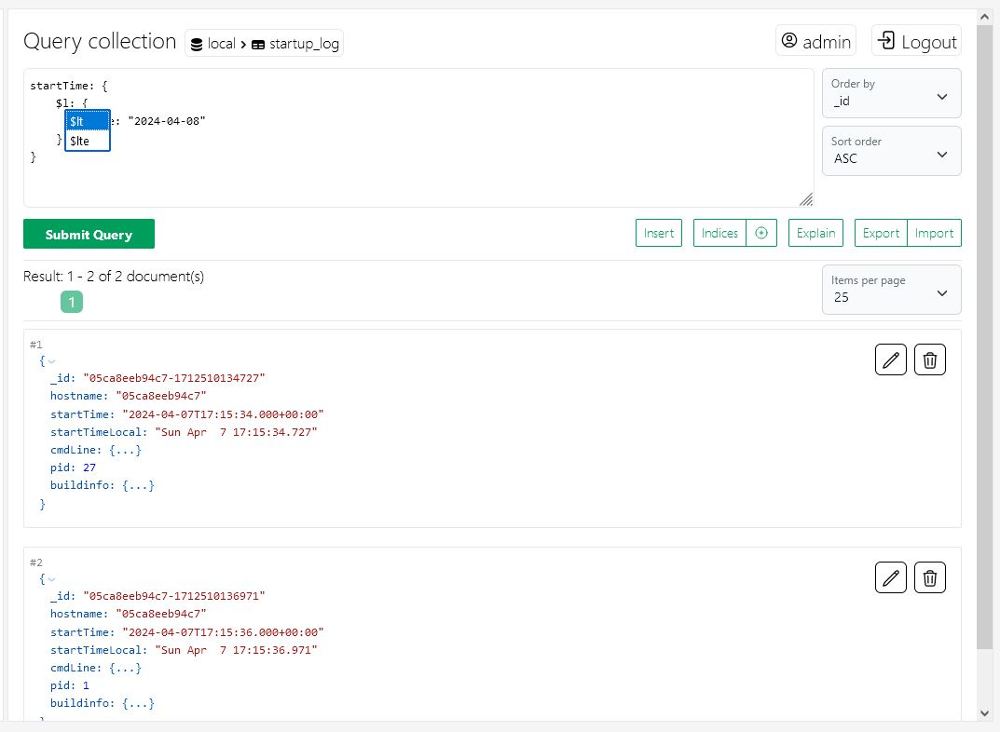

## Pagination, Sorting, Scrolling

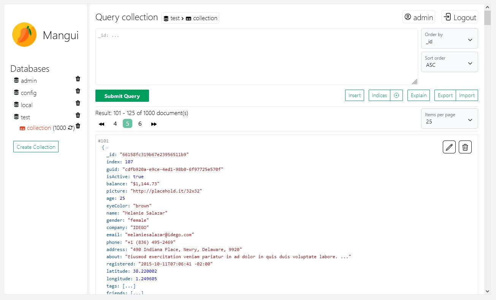
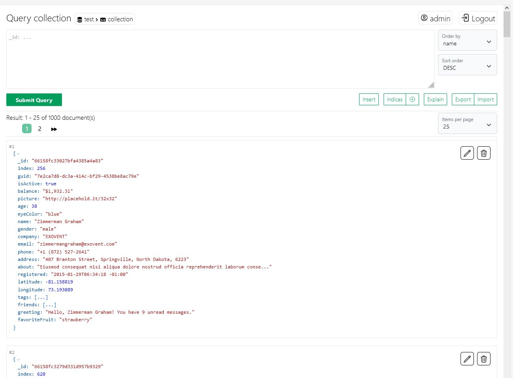
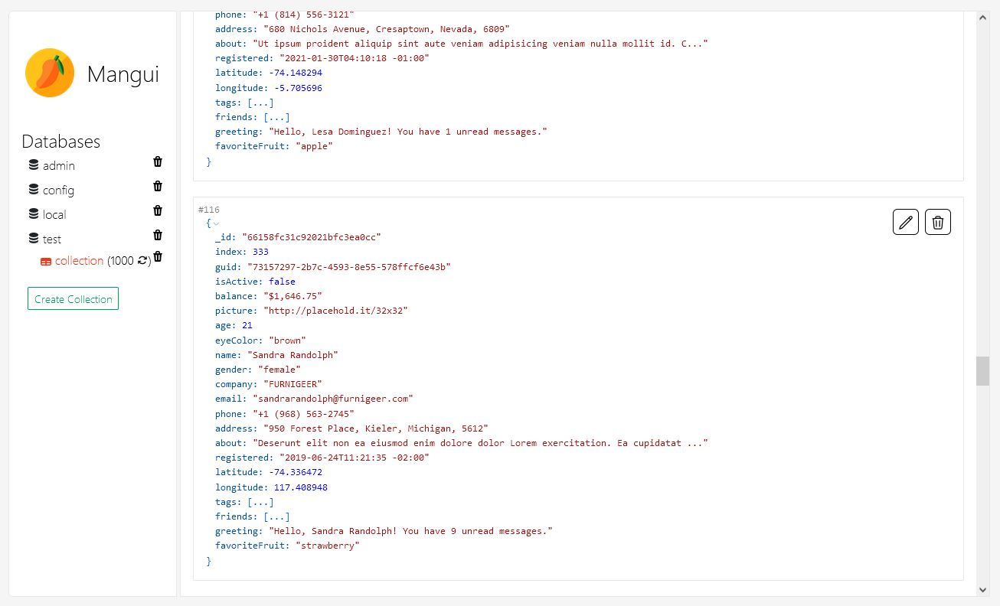

## Document management

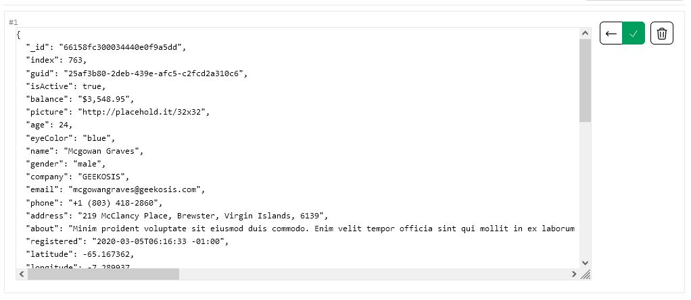
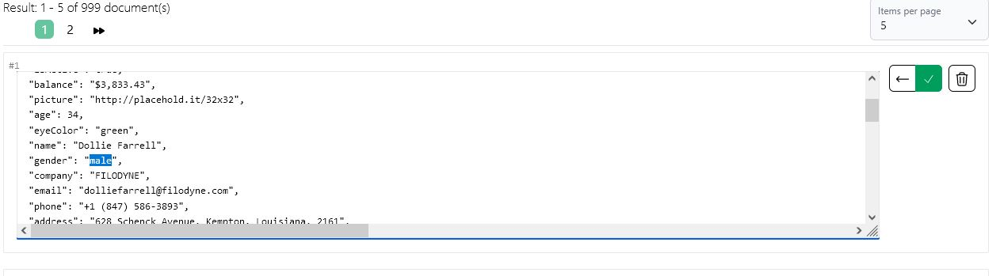
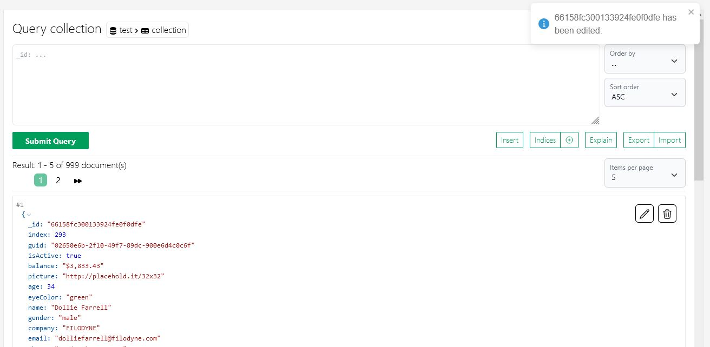

## Index management

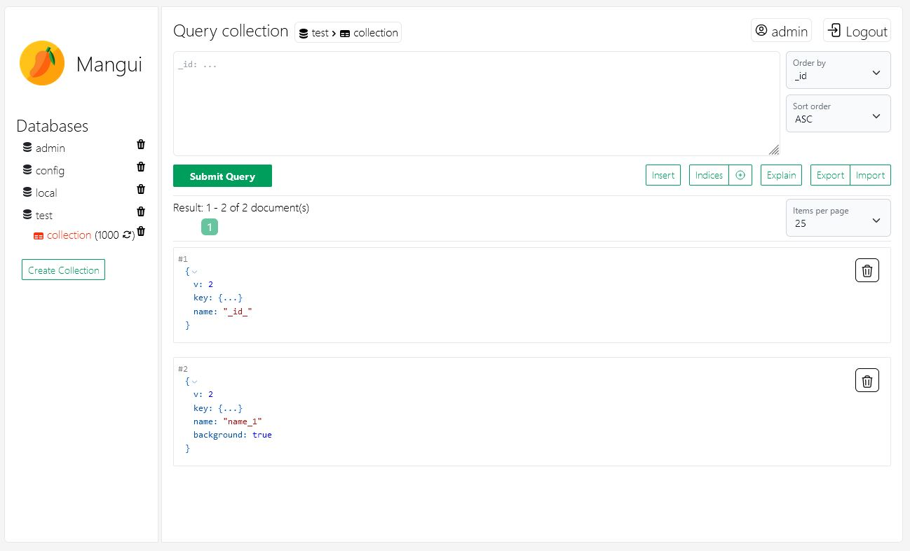
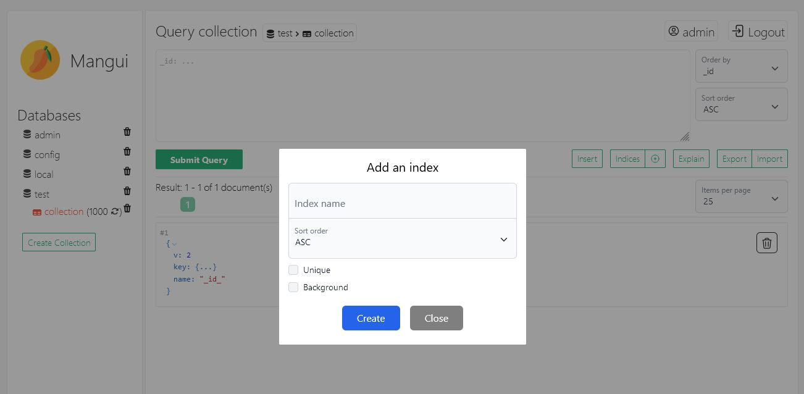

## User management

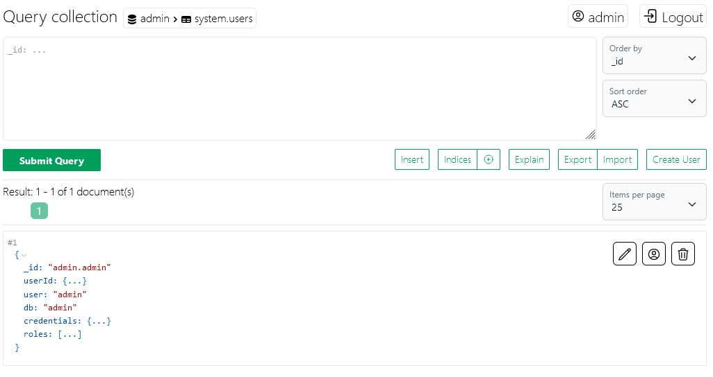
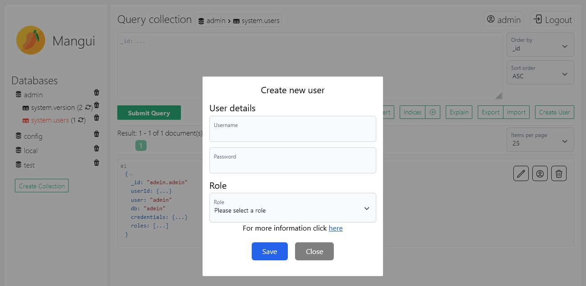
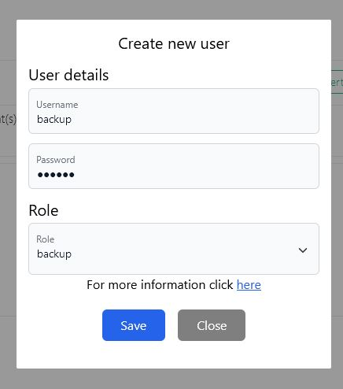
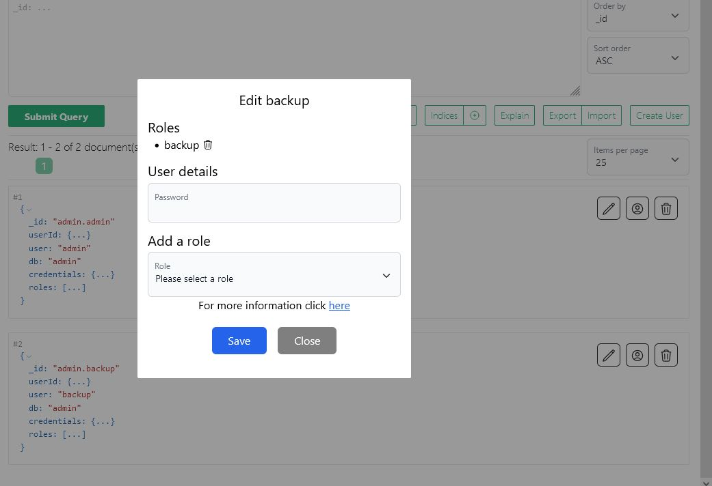
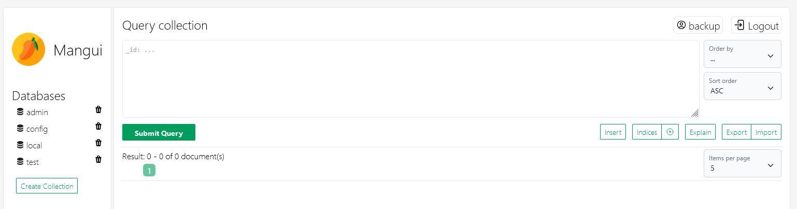

### [back](../README.md)
